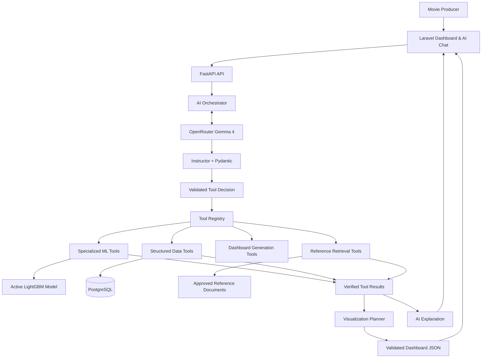

# MASTER IMPLEMENTATION PROMPT
# Movie Production Intelligence — AI Chat, Specialized ML Tools & Dynamic Dashboard MVP

## 1. Your Role

Act as a Senior Full-Stack Engineer, AI Systems Architect, MLOps Engineer, and Data Visualization Engineer.

Implement a working MVP of an **AI-Orchestrated Movie Production Intelligence Platform**.

The application allows movie producers to:

1. Upload and standardize historical movie datasets.
2. Train and deploy a LightGBM movie revenue prediction model.
3. Predict movie revenue using a budget in USD and multiple genres.
4. Ask natural-language questions through AI Chat.
5. Let AI select and execute specialized ML and data tools.
6. Compare baseline and budget-change scenarios.
7. Generate interactive analytics dashboards using natural-language requests.
8. Save and reopen generated dashboard layouts.
9. Understand predictions through evidence-grounded AI explanations.

The system must use **Instructor + Pydantic for all LLM-generated structured outputs**.

Do not implement fake tools, hardcoded predictions, or static dashboard data disguised as generated analytics.

First inspect the existing repositories, model notebook, inference endpoints, and dataset onboarding implementation. Reuse working functionality and avoid unnecessary rewrites.

---

# 2. Technology Stack

### Laravel Application

Responsibilities:
- Movie production dashboard.
- AI Chat interface.
- Movie prediction form.
- Dataset and training management UI where already available.
- Dynamic dashboard renderer.
- Template selection.
- Dashboard save/load.
- User authentication and authorization.

Use the existing Laravel frontend stack and UI conventions.

Use Select2 for searchable multiple-genre selection when compatible with the existing frontend.

Use Apache ECharts or the project's existing chart library for interactive visualizations.

### FastAPI Application

Responsibilities:
- Dataset ingestion and validation.
- AI-assisted column mapping.
- Training orchestration.
- Model registry and inference.
- AI Chat orchestration.
- Structured data query tools.
- Specialized ML tools.
- Dashboard specification generation.
- Visualization data queries.
- Evidence-grounded AI response generation.

### AI Stack

- Provider: OpenRouter.
- Model: `google/gemma-4-26b-a4b-it:free`.
- Structured output: **Instructor**.
- Schema validation: Pydantic v2.
- Tool orchestration: Python tool registry.
- Default generation mode: `instructor.Mode.JSON`.
- Native tool calling: Optional compatibility enhancement.

### ML Stack

- LightGBM.
- Pandas.
- Scikit-learn preprocessing.
- Existing model registry.
- Existing training orchestration.
- PostgreSQL for metadata.
- Celery + Redis for asynchronous training.

Do not introduce LangChain, LangGraph, or complex multi-agent frameworks for this MVP.

---

# 3. System Architecture



Separate the system into two operational pipelines:

**Offline MLOps pipeline:**

Dataset Upload → AI Mapping → Approval → Validation → Training → Evaluation → Model Registry → Promotion.

**Online analytics pipeline:**

User Request → AI Intent Routing → Authorized Tool Execution → Verified Results → Dashboard Specification → Laravel Rendering.

Do not trigger model retraining automatically during chat.

---

# 4. Mandatory Instructor Integration

Instructor must be the central interface for all structured LLM responses.

Use Instructor for:

- Dataset mapping suggestions.
- Chat intent classification.
- Tool selection.
- Tool argument extraction.
- Visualization planning.
- Dashboard JSON generation.
- Structured AI insights.

Do not rely on manually extracting JSON from Markdown code blocks as the primary mechanism.

## 4.1 Configuration

```dotenv
AI_PROVIDER=openrouter
OPENROUTER_API_KEY=
OPENROUTER_BASE_URL=https://openrouter.ai/api/v1
OPENROUTER_MODEL=google/gemma-4-26b-a4b-it:free
INSTRUCTOR_MODE=json
AI_MAX_RETRIES=2
AI_TIMEOUT_SECONDS=45
```

## 4.2 Implementation

Create:

`app/ai/instructor_client.py`

Example:

```python
import os
import instructor

from openai import AsyncOpenAI

openai_client = AsyncOpenAI(
    api_key=os.environ["OPENROUTER_API_KEY"],
    base_url="https://openrouter.ai/api/v1",
    timeout=45,
)

client = instructor.from_openai(
    openai_client,
    mode=instructor.Mode.JSON,
)
```

Create reusable methods such as:

```python
async def generate_structured(
    messages,
    response_model,
):
    return await client.chat.completions.create(
        model=settings.OPENROUTER_MODEL,
        messages=messages,
        response_model=response_model,
        max_retries=2,
    )
```

Adapt the example to the installed Instructor version and verify compatibility through tests.

All successful LLM calls must return validated Pydantic objects. Serialize them to JSON for external API responses.

Instructor retries must be bounded. Invalid outputs after retries must return a controlled error or use an explicit safe fallback.

Do not assume Instructor makes every output valid automatically.

Do not use `eval`, `exec`, or arbitrary generated code.

---

# 5. AI Orchestration Through Structured JSON

The application must NOT depend on native LLM tool calling.

Instead, implement application-managed orchestration.

## 5.1 Tool Decision Schema

```python
from typing import Literal
from pydantic import BaseModel, Field

class ToolCall(BaseModel):
    tool_name: Literal[
        "predict_movie_revenue",
        "simulate_budget_shock",
        "get_active_movie_model",
        "get_movie_dataset_statistics",
        "query_movie_analytics",
        "search_movie_references",
    ]
    arguments: dict = Field(default_factory=dict)

class ChatDecision(BaseModel):
    intent: Literal[
        "prediction",
        "scenario_comparison",
        "historical_analysis",
        "dashboard_generation",
        "model_information",
        "general_question",
    ]

    requires_tools: bool
    tool_calls: list[ToolCall] = Field(default_factory=list)
    reasoning_summary: str
```

The `reasoning_summary` is a short user-facing rationale for the planned operations, not hidden chain-of-thought.

The LLM must return this schema through Instructor.

The backend must validate every selected tool against a server-side allowlist.

## 5.2 Orchestration Algorithm

Implement:

1. Receive user message and authorized project context.
2. Retrieve relevant existing conversation state.
3. Call the LLM through Instructor for intent and tool selection.
4. Validate tool names.
5. Validate arguments using tool-specific Pydantic models.
6. Check authorization and project ownership.
7. Execute selected tools.
8. Collect structured results.
9. Optionally execute a second tool-planning step when needed.
10. Generate a grounded final answer using Instructor.
11. Return structured response to Laravel.

Limit execution to a maximum of three tool calls per chat request.

Prevent recursion and infinite tool-calling loops.

If tools fail, preserve structured errors and do not fabricate successful results.

---

# 6. Specialized Movie ML Tools

Implement these tools using the existing inference service.

## Tool A — predict_movie_revenue

Input:

```json
{
  "budget": 2000000,
  "currency": "USD",
  "genres": ["Action", "Sci-Fi"]
}
```

Responsibilities:

- Resolve the active movie revenue model.
- Validate required features.
- Validate selected genres.
- Apply the trained preprocessing pipeline.
- Perform real LightGBM inference.
- Return model version and prediction metadata.

For a point prediction model:

```json
{
  "prediction_type": "point",
  "currency": "USD",
  "predicted_revenue": 3200000,
  "model_version": "movie-v1"
}
```

Numbers above are illustrative.

Do not invent uncertainty intervals.

## Tool B — simulate_budget_shock

Input:

```json
{
  "budget": 2000000,
  "genres": ["Action", "Sci-Fi"],
  "budget_change_percentage": -20
}
```

Process:

1. Calculate the adjusted budget deterministically.
2. Execute baseline prediction.
3. Execute modified scenario prediction.
4. Calculate differences.
5. Return both outputs.
6. Include relevant assumptions and limitations.

Use identical active model versions for both predictions.

Do not describe the difference as a proven causal effect.

## Tool C — get_active_movie_model

Return:

- Model ID and version.
- Prediction target.
- Available features.
- Genre vocabulary.
- Output type.
- Evaluation metrics.
- Training data limitations.

## Tool D — get_movie_dataset_statistics

Return verified historical statistics from an approved dataset.

Examples:

- Number of movie records.
- Average revenue.
- Median production budget.
- Revenue distribution by genre.
- Budget distribution.

## Tool E — query_movie_analytics

Support predefined analytical operations.

Examples:

- `average_revenue_by_genre`
- `revenue_by_budget_bucket`
- `movie_count_by_genre`
- `budget_revenue_scatter`

Do not allow arbitrary SQL generated by the LLM.

Use parameterized queries or approved analytical functions.

When movies have multiple genres, define and document how records contribute to genre-level aggregates.

## Tool F — search_movie_references

Retrieve information from approved movie production reference materials.

For the MVP, implement a simple source-backed retrieval interface.

It may initially use document metadata, full-text search, or a small curated reference collection.

Do not falsely describe keyword search as semantic vector RAG.

Full embedding-based RAG is optional for this MVP.

---

# 7. Movie Prediction Form

Implement in Laravel.

## 7.1 Budget

Use USD for input and output where supported by the model.

Requirements:

- Prefix `$`.
- Thousands separators.
- Numeric payload to API.
- Non-negative validation.
- No automatic currency conversion.

## 7.2 Genres

Use searchable Select2 multiple selection.

Genre options must come dynamically from the active model's supported vocabulary.

Endpoint:

`GET /api/v1/models/active/features`

Do not hardcode genre categories.

Ensure training and inference use compatible multi-genre preprocessing.

If the current notebook only supports one genre, update the training adapter and retrain a compatible model.

Do not combine genres into arbitrary strings unless that is the model's documented preprocessing contract.

## 7.3 Prediction Results

Display:

- Production budget.
- Selected genres.
- Predicted revenue.
- Active model version.
- Model output type.
- Assumptions and limitations.
- Scenario comparison when requested.

Do not calculate a production profitability metric unless the necessary cost and revenue assumptions are explicitly defined.

---

# 8. Dynamic Dashboard Generation

Implement a dashboard generation engine based on **validated JSON specifications**.

The LLM must not generate arbitrary HTML, JavaScript, Blade templates, PHP, or SQL.

The LLM only chooses from predefined visualization components.

## 8.1 Supported Widget Types

For MVP:

1. `kpi`
2. `bar_chart`
3. `line_chart`
4. `scatter_chart`
5. `comparison`
6. `data_table`
7. `ai_insight`

Each widget must have:

- Unique ID.
- Supported widget type.
- Title.
- Verified data source reference.
- Layout information.
- Visualization configuration.
- Optional filters.
- Display formatting.

## 8.2 Dashboard Specification Schema

Implement Pydantic models similar to:

```python
from typing import Literal
from pydantic import BaseModel, Field

WidgetType = Literal[
    "kpi",
    "bar_chart",
    "line_chart",
    "scatter_chart",
    "comparison",
    "data_table",
    "ai_insight",
]

class WidgetSpec(BaseModel):
    id: str
    type: WidgetType
    title: str
    data_ref: str
    x_field: str | None = None
    y_field: str | None = None
    width: int = Field(default=6, ge=1, le=12)

class DashboardSpec(BaseModel):
    title: str
    domain: Literal["movie"]
    description: str | None = None
    widgets: list[WidgetSpec]
```

Extend these schemas as necessary with strict validation.

Use Instructor to generate `DashboardSpec`.

## 8.3 Two-Stage Generation

Dashboard generation must follow two stages.

### Stage A — Evidence Collection

The orchestrator executes relevant tools.

Example:

User asks:

"Generate a dashboard comparing Action and Comedy movie revenue and show my $2 million movie prediction."

The system may execute:

- Historical revenue by genre.
- Current movie revenue prediction.
- Active model information.

Each tool returns a structured, verified result.

### Stage B — Dashboard Planning

The LLM receives:

- User request.
- Available widget types.
- Verified tool result IDs.
- Available field names.
- Supported chart operations.

The LLM returns a validated `DashboardSpec`.

The LLM must not invent data references, fields, or metric values.

Backend validation must ensure that each `data_ref` resolves to an authorized tool result or approved dataset query.

## 8.4 Dashboard Rendering

Laravel must map widget types to reusable frontend components.

Example:

```text
kpi           -> KPI Card
bar_chart     -> ECharts Bar
line_chart    -> ECharts Line
scatter_chart -> ECharts Scatter
comparison    -> Scenario Comparison
data_table    -> Interactive Table
ai_insight    -> AI Explanation Card
```

The renderer must be driven by data and configuration, not dynamically generated source code.

Implement loading, empty, and error states.

## 8.5 Dashboard Persistence

Users must be able to:

- Generate a dashboard.
- Preview the dashboard.
- Save the dashboard.
- Reopen the dashboard.
- Regenerate or refresh its data.

Store:

- Dashboard ID.
- User/project ownership.
- Dashboard title.
- JSON specification.
- Referenced data sources.
- Generation timestamp.
- Relevant model version.
- Data refresh policy.

For prediction-based dashboards, preserve the model version used to generate each result.

Do not silently replace a saved historical prediction with a new model's prediction without indicating that the result has been refreshed.

---

# 9. Prebuilt Dashboard Templates

Implement two initial movie templates.

## Template 1 — Movie Revenue Overview

Components:

- Production budget KPI.
- Predicted revenue KPI.
- Genre selection summary.
- Active model version.
- Historical average revenue by genre.
- AI insight.

## Template 2 — Budget Scenario Comparison

Components:

- Baseline budget.
- Modified budget.
- Baseline predicted revenue.
- Modified predicted revenue.
- Revenue difference.
- Scenario comparison chart.
- Assumptions and limitations.

Templates must consume the same validated data contracts as AI-generated dashboards.

Use shared widget components.

Do not build a separate visualization implementation for templates and generated dashboards.

---

# 10. AI Chat Response Contract

All LLM-generated final responses must be validated using Instructor.

Create:

```python
from typing import Literal
from pydantic import BaseModel, Field

class ChatResponse(BaseModel):
    response_type: Literal[
        "text",
        "prediction",
        "scenario",
        "dashboard",
        "error",
    ]

    message: str

    used_tools: list[str] = Field(default_factory=list)

    dashboard_id: str | None = None

    warnings: list[str] = Field(default_factory=list)

    references: list[str] = Field(default_factory=list)
```

The final HTTP response may additionally contain deterministic backend-generated fields such as:

- Tool execution IDs.
- Structured ML outputs.
- Model version.
- Dashboard specification.
- Data source metadata.

Do not ask the LLM to reproduce authoritative numeric prediction payloads unnecessarily.

The API should combine validated LLM text with the original structured tool results.

### AI Response Rules

The assistant must:

- Explain actual ML predictions.
- State assumptions.
- Distinguish historical statistics from predictions.
- Identify model limitations.
- Include retrieved document references when used.
- Never invent model metrics.
- Never claim a simulated budget change proves causation.
- Avoid definitive production investment decisions.
- Keep the producer as the final decision-maker.

---

# 11. API Endpoints

Implement or reuse:

### AI Chat

`POST /api/v1/chat`

### Model & Prediction

`GET /api/v1/models/active`

`GET /api/v1/models/active/features`

`POST /api/v1/predictions/movie/revenue`

### Scenario Analysis

`POST /api/v1/scenarios/movie/budget`

### Dataset Analytics

`GET /api/v1/datasets/{id}/statistics`

`POST /api/v1/analytics/movie/query`

### Dashboard

`GET /api/v1/dashboard/templates`

`GET /api/v1/dashboard/templates/{id}`

`POST /api/v1/dashboard/generate`

`POST /api/v1/dashboard/widgets/query`

`POST /api/v1/dashboard`

`GET /api/v1/dashboard/{id}`

`POST /api/v1/dashboard/{id}/refresh`

Reuse existing endpoint contracts when equivalent functionality is already implemented.

Avoid breaking previously implemented APIs.

---

# 12. Suggested FastAPI Structure

```text
app/
├── ai/
│   ├── instructor_client.py
│   ├── orchestrator.py
│   ├── intent_router.py
│   ├── tool_registry.py
│   ├── tool_executor.py
│   ├── schemas/
│   │   ├── chat.py
│   │   ├── tool_decision.py
│   │   └── dashboard.py
│   └── prompts/
│       ├── system.md
│       ├── movie.md
│       └── visualization.md
│
├── tools/
│   ├── ml/
│   │   ├── predict_revenue.py
│   │   └── budget_scenario.py
│   ├── data/
│   │   ├── movie_statistics.py
│   │   └── movie_analytics.py
│   ├── reference/
│   │   └── search_references.py
│   └── model/
│       └── get_active_model.py
│
├── dashboards/
│   ├── planner.py
│   ├── validator.py
│   ├── renderer_contract.py
│   ├── data_resolver.py
│   ├── persistence.py
│   └── templates/
│       ├── movie_revenue.json
│       └── budget_scenario.json
│
├── ml/
│   ├── inference.py
│   └── registry.py
│
└── api/
    └── routes/
        ├── chat.py
        ├── dashboard.py
        ├── predictions.py
        └── analytics.py
```

Adapt to existing architecture rather than duplicating modules.

---

# 13. Laravel Integration

Use Laravel as the public application entry point.

FastAPI should remain an internal service wherever possible.

Example:

```dotenv
FASTAPI_BASE_URL=http://fastapi:8000
FASTAPI_SERVICE_TOKEN=
```

Laravel must proxy authorized API requests to FastAPI.

Do not expose private service credentials to the browser.

Build these pages or modules:

- Movie Prediction.
- AI Chat.
- Movie Analytics Dashboard.
- Generated Dashboard Viewer.
- Saved Dashboards.

The chat must be able to display:

- Text responses.
- Prediction results.
- Scenario comparisons.
- Generated dashboard previews.

Generated charts must use actual tool results.

---

# 14. Security & Reliability

Implement:

- Authenticated API requests.
- Project-level authorization.
- Strict Pydantic validation.
- Tool execution allowlists.
- Maximum tool-call limits.
- LLM request timeout.
- OpenRouter rate-limit handling.
- Structured logging.
- Safe error handling.
- Dataset query restrictions.
- Dashboard data reference validation.
- No arbitrary SQL execution.
- No arbitrary Python execution.
- No arbitrary HTML/JavaScript generation.
- No arbitrary filesystem access.

Instructor validation does not replace authorization or security checks.

Use approved tool functions for all sensitive operations.

---

# 15. Testing

Write automated tests for each major component.

## Instructor Tests

- Valid structured output.
- Invalid LLM JSON.
- Unsupported tool name.
- Invalid tool arguments.
- Invalid widget type.
- Invalid dashboard data reference.
- Retry exhaustion.
- OpenRouter timeout.
- Free-tier rate limit.

## ML Tests

- Actual LightGBM inference.
- Multiple genres.
- USD budget validation.
- Model version consistency.
- Budget scenario comparison.
- Missing active model.
- Unsupported model features.

## Dashboard Tests

- Template rendering.
- AI-generated valid dashboard specification.
- Rejection of hallucinated data references.
- Chart data binding.
- Dashboard save/load.
- Dashboard refresh.
- Model version provenance.
- Empty analytics results.

## AI Chat Tests

- Prediction request.
- Scenario comparison request.
- Historical analytics request.
- Dashboard generation request.
- Tool selection.
- Safe execution.
- Grounded explanation.

Use mocked OpenRouter responses for deterministic automated tests.

Use real model artifacts and actual database queries for integration tests.

---

# 16. End-to-End Acceptance Scenario

Implement and demonstrate the following complete workflow.

### Scenario A — Movie Prediction

1. User enters a movie budget of $2,000,000.
2. User selects Action and Sci-Fi.
3. Laravel submits prediction request.
4. FastAPI validates the active model contract.
5. LightGBM produces a real revenue prediction.
6. Laravel displays the prediction and model metadata.

### Scenario B — AI Scenario Analysis

User asks:

"What happens if my movie budget is reduced by 20%?"

Expected execution:

1. Instructor returns a validated scenario intent.
2. FastAPI selects the budget scenario tool.
3. Backend calculates modified budget.
4. ML inference runs for baseline and modified scenarios.
5. Structured results are returned.
6. AI explains the comparison without inventing values.

### Scenario C — AI-Generated Dashboard

User asks:

"Generate a dashboard comparing Action and Comedy historical revenue with my movie prediction."

Expected execution:

1. Instructor classifies dashboard-generation intent.
2. Orchestrator selects historical analytics and ML prediction tools.
3. FastAPI executes the tools.
4. Verified results are collected.
5. Instructor generates a `DashboardSpec`.
6. Pydantic validates widget structure.
7. Backend validates data references and fields.
8. Laravel renders interactive charts.
9. User saves the dashboard.
10. User can reopen the saved dashboard.

### Scenario D — OpenRouter Failure

If the LLM provider is unavailable:

- Existing manual movie prediction must still work.
- Existing dashboard templates must still work.
- Historical analytics endpoints must still work.
- Chat and AI generation return clear errors or documented deterministic fallbacks.
- The system must not fabricate AI responses.

---

# 17. Implementation Priorities

## Phase 1 — Existing Model Integration

Inspect LightGBM training artifacts and confirm:
- Budget currency.
- Available features.
- Multi-genre preprocessing.
- Target output.
- Active model inference contract.

Fix compatibility issues before developing AI-generated dashboards.

## Phase 2 — Instructor-Based AI Orchestrator

Implement:
- Instructor client.
- Structured chat decision schema.
- Tool registry.
- Tool executor.
- ML prediction tool.
- Budget scenario tool.

Complete chat-to-ML integration first.

## Phase 3 — Structured Data Analytics

Implement:
- Historical movie statistics.
- Approved dataset query functions.
- Reusable analytical result contracts.

## Phase 4 — Dashboard Specification Engine

Implement:
- Dashboard Pydantic schemas.
- Visualization planner.
- Data binding.
- Backend validation.
- Movie dashboard templates.

## Phase 5 — Laravel Dashboard

Implement:
- Movie prediction UI.
- Chat interface.
- Dynamic chart renderer.
- Generated dashboard viewer.
- Save/load functionality.

## Phase 6 — Integration Testing

Execute the complete acceptance scenarios.

Fix failing critical paths before adding secondary features.

---

# 18. Explicitly Out of Scope

Do not implement:

- Advertising models.
- Event models.
- Music models.
- Autonomous model training through chat.
- Arbitrary code generation and execution.
- Full no-code BI editor.
- Drag-and-drop dashboard designer.
- Complex multi-agent architecture.
- Real-time streaming analytics.
- Automated web scraping.
- Automatic business investment decisions.
- Full semantic vector RAG infrastructure unless already available.
- Unverified ROI or survival probability predictions.

Prioritize the movie use case.

---

# 19. Definition of Done

The implementation is complete when:

- [ ] Instructor is integrated with OpenRouter.
- [ ] LLM structured outputs are validated by Pydantic.
- [ ] AI Chat can select specialized ML tools.
- [ ] FastAPI executes real LightGBM inference.
- [ ] Budget inputs and outputs use verified USD conventions.
- [ ] Multiple genres are supported by the actual model.
- [ ] AI Chat can compare baseline and budget scenarios.
- [ ] Structured historical analytics are available.
- [ ] AI can generate a valid dashboard JSON specification.
- [ ] Laravel renders generated dashboards interactively.
- [ ] Dashboard templates and generated dashboards share the same components.
- [ ] Generated widgets use verified data references.
- [ ] Dashboards can be saved and reopened.
- [ ] Model versions and assumptions are visible.
- [ ] AI-generated explanations are grounded in real tool results.
- [ ] Existing dataset onboarding and model training continue working.
- [ ] End-to-end tests pass.

---

# 20. Final Instructions

Inspect the existing implementation before writing new code.

Identify reusable services and integration points.

Develop the smallest complete vertical slice first:

**Movie Prediction → AI Tool Orchestration → Verified ML Results → Instructor DashboardSpec → Interactive Laravel Dashboard.**

Use Instructor for all LLM-generated JSON decisions, mapping suggestions, explanations, and dashboard specifications.

Do not silently fall back to unvalidated LLM outputs.

Do not replace actual ML inference with LLM estimates.

Do not generate arbitrary frontend source code.

Ensure every generated dashboard widget is backed by validated data.

Continue implementation through testing and documentation, rather than stopping after architecture planning.

Report the actual implementation status and test results when complete.