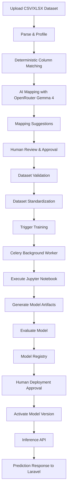

# MASTER IMPLEMENTATION PROMPT
## FastAPI — AI-Powered Dataset Onboarding, Training Orchestration & Model Deployment Platform

### Your Role

Act as a Senior Python Backend Engineer, MLOps Architect, and AI Integration Engineer.

You are responsible for designing, implementing, testing, and documenting a fully functional FastAPI backend for an AI-driven Production Survivability application.

**Do not stop at planning, scaffolding, or generating placeholder code. Implement and test a working end-to-end system.**

---

# 1. Product Context

The overall product helps producers in the entertainment industry understand potential production risks and predict audience demand and revenue.

The initial domain is **film production**, with potential future expansion into events, music, advertising, and other entertainment production categories.

The overall application consists of two main components.

### Component A — Laravel Dashboard (Outside Your Scope)

Laravel is responsible for:

- User authentication and management.
- Production planning interfaces.
- Dataset upload and mapping approval interfaces.
- Training job management interfaces.
- Audience and revenue prediction visualization.
- Base-plan and disruption-scenario comparisons.
- Model version selection and promotion interfaces.

**Do not build Laravel or any frontend in this task.**

### Component B — FastAPI AI/ML Platform (Your Scope)

FastAPI is responsible for:

1. Dataset upload and ingestion.
2. Dataset profiling.
3. AI-assisted column mapping.
4. Human mapping approval workflow.
5. Dataset standardization and validation.
6. Asynchronous training job orchestration.
7. Jupyter Notebook execution.
8. Model artifact generation and packaging.
9. Model evaluation.
10. Model registry and versioning.
11. Model deployment through version promotion.
12. Inference API for Laravel.
13. Rollback and deployment health verification.

The entire pipeline must work independently of Laravel and be testable using Swagger, curl, or automated scripts.

---

# 2. Primary Objective

Implement this end-to-end workflow:



The Jupyter Notebook is initially a dummy implementation, but it must execute real training and produce an actual usable model artifact.

Do not simulate successful training or deployment with hardcoded responses.

Success means the entire pipeline can run without manually opening Jupyter Notebook, copying model files, editing Python source code, or rebuilding Docker containers.

---

# 3. Technology Stack

Use the following technologies.

| Component | Technology |
|---|---|
| Python | Python 3.12+ |
| API Framework | FastAPI |
| Data Processing | Pandas, OpenPyXL |
| Data Validation | Pydantic v2, Pandera |
| AI Provider | OpenRouter |
| AI Model | Google Gemma 4 26B A4B Free |
| LLM Integration | OpenAI-compatible Python SDK |
| Async Job Queue | Celery |
| Message Broker | Redis |
| Database | PostgreSQL |
| ORM | SQLAlchemy 2 |
| Migrations | Alembic |
| Notebook Execution | Papermill |
| Dummy ML Model | Scikit-learn |
| Future ML Model | LightGBM Quantile Regression |
| Artifact Storage | Local filesystem with storage abstraction |
| Testing | Pytest, HTTPX |
| Containerization | Docker Compose |

Avoid Kubernetes, Airflow, a separate MLflow server, distributed training, and additional infrastructure unless absolutely necessary.

Keep the architecture modular and maintainable, but prioritize a working implementation.

---

# 4. OpenRouter AI Configuration

Use OpenRouter as the main AI provider.

The default model must be:

`google/gemma-4-26b-a4b-it:free`

Configuration:

```dotenv
AI_PROVIDER=openrouter
OPENROUTER_API_KEY=
OPENROUTER_BASE_URL=https://openrouter.ai/api/v1
OPENROUTER_MODEL=google/gemma-4-26b-a4b-it:free
OPENROUTER_TIMEOUT_SECONDS=45
OPENROUTER_MAX_RETRIES=2
OPENROUTER_JSON_MODE=true
```

Implement a dedicated OpenRouter client:

`app/integrations/openrouter_client.py`

Use the OpenAI-compatible API.

For the specified free Gemma model, use JSON output when supported, followed by strict Pydantic validation.

Do not assume JSON Schema enforcement is available for this free endpoint.

### LLM Responsibilities

The LLM is ONLY responsible for semantic dataset understanding, including:

- Interpreting ambiguous column names.
- Suggesting mappings into a canonical schema.
- Explaining mapping recommendations.
- Identifying potential data type mismatches.
- Suggesting safe, predefined data transformation operations.
- Flagging uncertain or ambiguous mappings for human review.

The LLM must NOT:

- Train machine learning models.
- Execute generated Python code.
- Modify database schemas.
- Automatically approve its own recommendations.
- Generate missing revenue or audience targets.
- Execute arbitrary preprocessing expressions.
- Automatically deploy models.

### Fallback Requirements

OpenRouter free models can be rate-limited or unavailable.

Implement:

- Configurable request timeout.
- Retry with exponential backoff and jitter.
- HTTP 429 handling.
- Respect `Retry-After` where provided.
- Structured error logging.
- JSON parsing and validation.
- Deterministic fallback mapping.
- Manual mapping support when AI fails.

Do not automatically switch to paid models.

The training pipeline must remain operational even if OpenRouter is unavailable.

---

# 5. Dataset Onboarding

## FR-01 — Upload Dataset

Endpoint:

`POST /api/v1/datasets`

Accept multipart upload for CSV and XLSX.

Requirements:

- Validate file extension and actual file format.
- Enforce configurable maximum upload size.
- Reject empty or malformed datasets.
- Generate dataset UUID.
- Calculate SHA-256 checksum.
- Preserve immutable original file.
- Store dataset metadata in PostgreSQL.
- Detect basic row and column counts.
- Return dataset ID and initial status.

Suggested response:

```json
{
  "dataset_id": "uuid",
  "version": 1,
  "filename": "movie_history.csv",
  "status": "uploaded",
  "row_count": 1000,
  "column_count": 8
}
```

Secure uploaded file handling. Never trust user-provided filenames or paths.

## FR-02 — Dataset Profiling

Endpoint:

`GET /api/v1/datasets/{dataset_id}/profile`

Return:

- Column names.
- Inferred data types.
- Null counts and percentages.
- Duplicate row count.
- Numerical statistics.
- Categorical samples.
- Limited sample rows.
- Potential parsing problems.

Support configurable sampling to prevent excessive memory usage.

Example:

```json
{
  "dataset_id": "uuid",
  "columns": [
    {
      "name": "Production Cost",
      "dtype": "float64",
      "null_percentage": 0.02,
      "sample_values": [1200000, 850000, 2300000]
    }
  ]
}
```

---

# 6. AI-Assisted Schema Mapping

## FR-03 — Canonical Dataset Schema

Create a configurable schema registry.

Initial domain: `film`.

Example schema:

| Canonical Field | Data Type | Role |
|---|---|---|
| budget | float | Feature |
| genre | string | Feature |
| planned_duration | float | Feature |
| release_date | date | Feature |
| marketing_budget | float | Feature |
| revenue | float | Target |
| audience | float | Target |

Treat this as a starting schema, not a universal required schema.

Each training adapter must define its exact feature and target requirements.

For example, a revenue model requires `revenue` for supervised training, but an inference request does not include observed revenue.

Support optional fields and missing fields according to the model contract.

## FR-04 — Hybrid Mapping Engine

Endpoint:

`POST /api/v1/datasets/{dataset_id}/mapping/suggest`

Implement the following strategy:

1. Exact column name matching.
2. Known alias matching.
3. Deterministic string similarity.
4. OpenRouter Gemma 4 for ambiguous columns.
5. Pydantic output validation.
6. Conflict detection.
7. Return suggestions for human review.

Example aliases:

```python
COLUMN_ALIASES = {
    "budget": [
        "production_cost",
        "movie_budget",
        "film_cost"
    ],
    "revenue": [
        "box_office",
        "worldwide_gross",
        "total_gross"
    ],
    "genre": [
        "category",
        "film_genre"
    ]
}
```

Only send minimal metadata to OpenRouter:

- Source column names.
- Data types.
- Non-sensitive, sanitized sample values when necessary.
- Canonical schema definitions.
- Field descriptions.

Do not send the entire CSV or Excel file.

### Expected AI Response

```json
{
  "mappings": [
    {
      "source_column": "Production Cost",
      "target_column": "budget",
      "confidence": 0.96,
      "reason": "Represents production expenditure.",
      "transformation": "numeric",
      "requires_review": false
    }
  ],
  "unmapped_columns": [],
  "warnings": []
}
```

Confidence must be treated as a heuristic, not a calibrated statistical probability.

Validate that every source column and target field exists.

The LLM can only suggest operations from an explicit allowlist, such as numeric conversion, date parsing, categorical normalization, or exclusion.

Do not execute generated code.

## FR-05 — Mapping Approval

Endpoints:

`PUT /api/v1/datasets/{dataset_id}/mapping`

`POST /api/v1/datasets/{dataset_id}/mapping/approve`

Allow API consumers to:

- Inspect mapping suggestions.
- Override suggestions.
- Exclude columns.
- Resolve ambiguity.
- Approve the mapping.

Persist the approved mapping with a version identifier.

Training cannot proceed without an approved mapping.

If the mapping changes, the previous standardized dataset must not silently be reused.

Require revalidation and generation of a new standardized dataset version.

---

# 7. Data Validation & Transformation

## FR-06 — Dataset Standardization

Endpoint:

`POST /api/v1/datasets/{dataset_id}/validate`

After mapping approval:

1. Rename columns according to approved mapping.
2. Convert supported data types.
3. Apply safe deterministic transformations.
4. Validate required features.
5. Validate target availability.
6. Detect invalid numerical values.
7. Validate categorical data.
8. Detect duplicate rows.
9. Generate a standardized dataset.
10. Generate a validation report.

Use Pandera where appropriate.

Do not silently convert currencies without explicit units and conversion rules.

Do not fabricate missing financial values.

Do not automatically assume missing numeric values are zero.

Prevent target leakage by distinguishing pre-production features from information only available after the production or release.

Example response:

```json
{
  "dataset_id": "uuid",
  "validation_status": "passed",
  "training_ready": true,
  "standardized_version_id": "uuid",
  "valid_rows": 950,
  "invalid_rows": 50,
  "errors": [],
  "warnings": [
    "50 records excluded by approved cleaning rules"
  ]
}
```

Rows may only be excluded according to explicit deterministic rules, and exclusions must be auditable.

Training must use only the exact approved and validated dataset version.

---

# 8. Training Orchestration

## FR-07 — Asynchronous Training Trigger

Endpoint:

`POST /api/v1/training/jobs`

Request:

```json
{
  "dataset_version_id": "uuid",
  "model_type": "dummy_revenue",
  "target": "revenue",
  "parameters": {
    "random_seed": 42
  }
}
```

Requirements:

- Validate dataset readiness.
- Validate the training adapter contract.
- Create training job metadata.
- Enqueue the training task in Celery.
- Return HTTP 202 with job ID.
- Execute the training job outside the API process.
- Persist timestamps, status, error details, and results.
- Support idempotency keys.

Job states:

```text
queued
running
completed
failed
```

Endpoint:

`GET /api/v1/training/jobs/{job_id}`

Return:

```json
{
  "job_id": "uuid",
  "status": "completed",
  "model_version_id": "uuid",
  "metrics": {
    "mae": 125000,
    "rmse": 185000
  },
  "error": null
}
```

Do not perform long-running training synchronously in an HTTP request.

## FR-08 — Training Adapter

Design a reusable interface:

```python
class TrainingAdapter:
    def validate_dataset(self, dataset, config):
        ...

    def train(self, dataset_path, config, output_dir):
        ...

    def evaluate(self, model, validation_data):
        ...

    def export_artifacts(self, output_dir):
        ...
```

Implement the first adapter:

`DummyNotebookTrainingAdapter`

Design the interface so a future `LightGBMQuantileTrainingAdapter` can be added without changing dataset onboarding, orchestration, registry, or deployment APIs.

---

# 9. Dummy Jupyter Notebook

## FR-09 — Executable Notebook

Create:

`notebooks/dummy_training.ipynb`

Use Papermill to execute it from the Celery training worker.

The notebook must:

1. Receive dataset path.
2. Receive target column name.
3. Receive output directory.
4. Load standardized data.
5. Validate feature availability.
6. Split training and holdout data.
7. Perform deterministic preprocessing.
8. Train a lightweight Scikit-learn regression model.
9. Calculate real evaluation metrics.
10. Save the fitted model and preprocessing pipeline.
11. Export metrics and manifest.
12. Exit successfully or provide meaningful failure details.

Use a simple deterministic regression model.

For the MVP, returning a point prediction is sufficient.

Do not fabricate P10/P50/P90 from this dummy point prediction.

### Artifact Structure

```text
artifacts/
└── models/
    └── revenue_v1/
        ├── model.joblib
        ├── metrics.json
        ├── manifest.json
        └── executed_notebook.ipynb
```

Example manifest:

```json
{
  "model_type": "dummy_revenue",
  "artifact_version": "1",
  "training_dataset_version": "uuid",
  "target": "revenue",
  "feature_columns": [
    "budget",
    "genre",
    "planned_duration"
  ],
  "output_type": "point_prediction",
  "model_file": "model.joblib"
}
```

Save a complete fitted inference pipeline, including preprocessing.

The inference service must not refit encoders or reconstruct preprocessing from assumptions.

---

# 10. Model Build, Evaluation & Registry

## FR-10 — Model Artifact Packaging

Model build means producing and validating a deployable model artifact.

It does NOT mean rebuilding the FastAPI Docker image.

After training:

- Verify required output files.
- Verify artifact structure.
- Calculate checksums.
- Validate manifest fields.
- Verify preprocessing compatibility.
- Execute a basic inference smoke test.
- Store the immutable artifact.
- Register a candidate model version.

Invalid or incomplete artifacts must never be marked deployable.

## FR-11 — Model Registry

Endpoints:

`GET /api/v1/models`

`GET /api/v1/models/{model_id}`

`GET /api/v1/models/active`

Persist:

- Model ID.
- Model type.
- Dataset version.
- Mapping revision.
- Training job ID.
- Artifact location.
- Artifact checksum.
- Evaluation metrics.
- Creation timestamp.
- Model status.
- Training configuration.
- Pipeline version.

Model statuses:

```text
candidate
active
archived
rejected
```

The registry must identify one active model per model family or deployment target.

---

# 11. Model Deployment

## FR-12 — Model Promotion

Endpoint:

`POST /api/v1/models/{model_id}/promote`

Promotion must:

1. Verify candidate status.
2. Verify artifact integrity.
3. Check inference contract compatibility.
4. Check evaluation gate results.
5. Require explicit approval.
6. Load candidate model.
7. Execute inference smoke test.
8. Activate the new model.
9. Persist deployment metadata.
10. Retain the previous model for rollback.

Do not deploy a model solely because training completed.

### Deployment Strategy

Use logical model deployment rather than container redeployment.

The inference service should load the current active model from the registry.

Implement a safe version-switching strategy to ensure in-flight inference requests do not encounter partially loaded models.

For multiple API workers, do not rely solely on one process's in-memory active model pointer. Use a shared deployment version and a mechanism for workers to detect and load the new version before serving it.

Persist the active version so it can be restored after a container restart.

## FR-13 — Rollback

Endpoint:

`POST /api/v1/models/{model_id}/rollback`

Allow rollback to a previously registered, validated model.

Rollback must verify that the selected artifact exists and can perform inference.

Record deployment history.

---

# 12. Prediction API

## FR-14 — Inference

Endpoint:

`POST /api/v1/predictions/revenue`

Request:

```json
{
  "budget": 1500000,
  "genre": "Drama",
  "planned_duration": 45,
  "marketing_budget": 250000
}
```

The actual required fields must be determined by the active model's inference contract. Reject missing required features clearly.

Example response:

```json
{
  "model_version": "revenue_v1",
  "model_type": "dummy_revenue",
  "prediction_type": "point",
  "predicted_revenue": 1850000,
  "currency": null
}
```

This is an illustrative response, not an expected prediction value.

Only return a currency code when it is explicitly defined in the model and dataset contract.

When the real LightGBM quantile model is integrated, support:

```json
{
  "prediction_type": "quantile",
  "revenue": {
    "p10": 1000000,
    "p50": 1800000,
    "p90": 2800000
  }
}
```

Never synthesize quantile estimates from a point-estimate-only model.

The prediction endpoint must return the exact model version used for each request.

---

# 13. Database Design

Implement SQLAlchemy models and Alembic migrations for at least:

### datasets
Original uploaded dataset metadata.

### dataset_versions
Immutable file versions and checksums.

### dataset_profiles
Column analysis and profiling information.

### dataset_mappings
AI suggestions, user corrections, approval status, and revisions.

### dataset_validation_runs
Validation results and standardized dataset references.

### training_jobs
Queue status, execution timestamps, failure reasons, and model results.

### model_versions
Model artifacts, versioning, metrics, and compatibility metadata.

### model_deployments
Active version, deployment history, approval, and rollback tracking.

Use UUID identifiers, timestamps, indexes, foreign keys, and appropriate constraints.

Maintain a clear separation between immutable artifacts and mutable workflow state.

---

# 14. API Security & Reliability

Implement:

- Internal service API authentication.
- Configuration through environment variables.
- CORS configuration for integration where needed.
- Input validation.
- File upload size limits.
- Trusted storage path resolution.
- Restricted artifact loading.
- Basic audit logging.
- Structured exceptions.
- Request and training job correlation IDs.
- Health and readiness endpoints.

Dataset and notebook content must be considered untrusted.

Avoid logging complete uploaded datasets or credentials.

Do not allow arbitrary notebook execution paths from user requests.

Use predefined notebook adapters and approved pipeline configurations.

For the hackathon, a trusted Laravel-to-FastAPI service token is acceptable as the initial security layer.

---

# 15. Docker Compose

Create a working local environment.

Services:

```text
fastapi-api
celery-worker
redis
postgres
```

Requirements:

- Shared persistent artifact storage for API and worker.
- Health checks.
- Configuration through `.env`.
- Database migrations.
- Consistent Python dependencies.
- Restart policies.
- No publicly exposed Redis or PostgreSQL by default.
- Notebook execution supported inside the worker image.

Provide a single documented command to start the platform.

---

# 16. Project Structure

Use a structure similar to:

```text
app/
├── main.py
├── api/
│   ├── dependencies.py
│   └── routes/
│       ├── datasets.py
│       ├── mappings.py
│       ├── training.py
│       ├── models.py
│       └── predictions.py
├── core/
│   ├── config.py
│   ├── security.py
│   └── logging.py
├── db/
│   ├── models.py
│   └── session.py
├── schemas/
│   ├── datasets.py
│   ├── mappings.py
│   ├── training.py
│   └── models.py
├── services/
│   ├── dataset_service.py
│   ├── profiling_service.py
│   ├── mapping_service.py
│   ├── validation_service.py
│   ├── training_service.py
│   ├── registry_service.py
│   ├── deployment_service.py
│   └── inference_service.py
├── integrations/
│   └── openrouter_client.py
├── ml/
│   ├── adapters/
│   │   ├── base.py
│   │   └── dummy_notebook.py
│   └── contracts.py
└── workers/
    ├── celery_app.py
    └── tasks.py

alembic/
notebooks/
├── dummy_training.ipynb
artifacts/
tests/
scripts/
├── generate_demo_dataset.py
└── e2e_demo.py

Dockerfile
docker-compose.yml
pyproject.toml
.env.example
README.md
AGENTS.md
```

Maintain separation between API routing, domain logic, infrastructure, and training implementations.

---

# 17. Testing Requirements

Implement unit, integration, and end-to-end tests.

### Mandatory E2E Scenario

Generate a synthetic dataset with deliberately non-standard columns, such as:

```text
Film Category
Production Cost
Marketing Spend
Production Days
Box Office Income
```

Execute:

1. Upload the dataset.
2. Confirm metadata persisted.
3. Retrieve dataset profile.
4. Trigger AI-assisted mapping.
5. Verify source columns are mapped to canonical fields.
6. Modify one mapping manually.
7. Approve the mapping.
8. Validate and standardize the data.
9. Trigger dummy notebook training.
10. Receive training job ID.
11. Poll job status.
12. Verify Papermill executed the notebook.
13. Verify real model artifacts exist.
14. Verify evaluation metrics exist.
15. Verify model is registered as a candidate.
16. Promote the candidate model.
17. Call prediction endpoint.
18. Verify inference uses the promoted model.
19. Train and deploy a second version.
20. Verify the active version changes.
21. Roll back to the previous version.
22. Verify predictions still work.

### Failure Tests

Include:

- Invalid CSV.
- Invalid Excel.
- Empty dataset.
- Missing target.
- Mapping not approved.
- Duplicate mapping conflict.
- LLM timeout.
- OpenRouter HTTP 429.
- Malformed LLM JSON.
- Invalid or unknown LLM column suggestions.
- Celery worker failure.
- Notebook execution failure.
- Missing artifact.
- Corrupt artifact.
- Failed deployment smoke test.
- Rollback to unavailable model.

Use mocked OpenRouter responses in automated CI tests.

Provide an optional live OpenRouter smoke test, enabled only when a valid API key is configured.

---

# 18. Execution Plan

Implement the system in five phases.

### Phase 1 — Infrastructure & Dataset Ingestion
- FastAPI project.
- PostgreSQL and Alembic.
- Docker Compose.
- Dataset upload.
- Dataset profiling.

### Phase 2 — AI Dataset Onboarding
- Canonical schema registry.
- Deterministic matching.
- Gemma 4 OpenRouter integration.
- Mapping approval.
- Data validation and standardization.

### Phase 3 — Training Automation
- Celery worker.
- Redis queue.
- Training API.
- Dummy Jupyter Notebook.
- Real notebook execution.
- Artifact packaging.

### Phase 4 — Model Registry & Deployment
- Model evaluation.
- Version registry.
- Promotion.
- Inference.
- Rollback.

### Phase 5 — E2E Testing & Documentation
- Generate sample datasets.
- Run automated tests.
- Execute complete E2E scenario.
- Document failures and limitations.
- Create integration examples for Laravel.

Complete one functional vertical slice before adding advanced functionality.

---

# 19. Explicitly Out of Scope

Do not implement:

- Laravel dashboard.
- Production scenario simulator.
- Monte Carlo simulation.
- Real audience/revenue quantile model.
- Automatic hyperparameter optimization.
- Scheduled retraining.
- Data drift monitoring.
- Cloud Kubernetes deployment.
- Multi-tenant billing.
- Complex agent frameworks.
- Arbitrary AI-generated Python transformation code.
- Automatic promotion without evaluation and authorization.

Focus only on the FastAPI AI/ML platform and its working orchestration.

---

# 20. Deliverables

Provide:

1. Complete FastAPI source code.
2. OpenRouter Gemma integration.
3. Dataset ingestion and profiling.
4. AI mapping and approval workflow.
5. Dataset standardization.
6. Celery-based training orchestration.
7. Executable dummy Jupyter Notebook.
8. Model artifact packaging.
9. Model registry.
10. Model promotion and rollback.
11. Working inference API.
12. PostgreSQL migrations.
13. Docker Compose environment.
14. Example synthetic dataset generator.
15. Automated end-to-end tests.
16. OpenAPI/Swagger documentation.
17. README.
18. AGENTS.md.

The README must explain:

- How to configure OpenRouter.
- How to start the application.
- How to upload a dataset.
- How to approve a mapping.
- How to trigger training.
- How to inspect training status.
- How to promote and roll back a model.
- How Laravel should consume the inference API.
- How to replace the dummy notebook with the real LightGBM notebook.

---

# 21. Definition of Done

The implementation is considered complete only when:

- [ ] FastAPI starts successfully using Docker Compose.
- [ ] PostgreSQL migrations run successfully.
- [ ] CSV and XLSX uploads work.
- [ ] Dataset profiling works.
- [ ] OpenRouter Gemma can generate real mapping suggestions when configured.
- [ ] Deterministic/manual fallback works without OpenRouter.
- [ ] Mapping approval is enforced.
- [ ] Dataset standardization works.
- [ ] Training jobs execute asynchronously.
- [ ] Papermill executes an actual notebook.
- [ ] A real Scikit-learn model artifact is generated.
- [ ] Evaluation metrics are calculated.
- [ ] Model registry tracks versions.
- [ ] Candidate model can be promoted.
- [ ] Inference works using the active model.
- [ ] Model activation requires no backend container rebuild.
- [ ] Rollback works.
- [ ] End-to-end tests pass.
- [ ] All critical APIs are documented.

## Final Instruction

Start by inspecting the existing repository and identifying reusable infrastructure.

If no project exists, initialize the project using the architecture above.

Create a concise implementation plan, then implement each phase in order.

Do not stop after writing the plan.

Do not replace functional code with TODOs, mocks, or placeholder responses in the production implementation.

Mocking is allowed for isolated automated tests and the external LLM provider.

Prioritize a complete, working vertical slice covering:

**Dataset Upload → AI Mapping → Approval → Validation → Training → Artifact Build → Model Registry → Promotion → Inference → Rollback.**

Run the available tests and report the actual execution results.

Explicitly identify anything that could not be implemented or verified.

The ultimate goal is to demonstrate a functional AI-powered MLOps pipeline that can later integrate a real LightGBM quantile regression model without redesigning its orchestration layer.