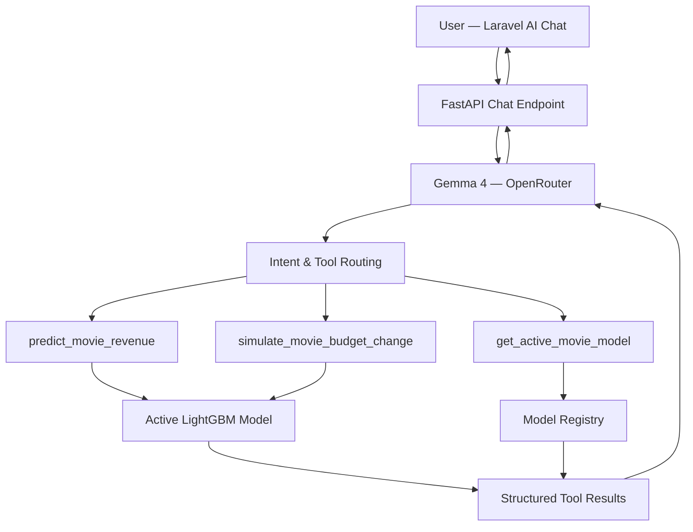

# IMPLEMENTATION PROMPT — Movie Prediction & AI Chat with Specialized ML Tools

## 1. Role & Objective

Act as a Senior Full-Stack Engineer, AI Engineer, and MLOps Integration Architect.

Extend the existing Production Survivability application with a **Movie Revenue Prediction Dashboard and AI Chat Assistant** powered by specialized ML functions.

A dashboard compares the base plan with shock scenarios (cost, finish date, revenue, risk) and shows every assumption so producers can challenge results.

The project uses:
- **Laravel:** Dashboard, user interaction, forms, and chat UI.
- **FastAPI:** Model inference, ML tool registry, AI orchestration, and structured prediction results.
- **OpenRouter:** Google Gemma 4 26B A4B Free for intent understanding, tool calling, and natural-language explanations.
- **LightGBM:** Movie revenue prediction using the currently available trained model.

Inspect the existing repositories and implementation first. Reuse their conventions and APIs rather than rebuilding working functionality.

**Scope is strictly MOVIE production. Do not implement advertising, campaigns, music, or events yet.**

---

## 2. User Experience

Users should be able to:

1. Create or configure a movie prediction scenario.
2. Enter a production budget in **USD ($)**.
3. Select one or multiple movie genres.
4. Choose genres from the dataset/model's available genre vocabulary.
5. Provide other inputs required by the active ML model.
6. Generate movie revenue predictions.
7. View model results and the assumptions used.
8. Ask questions through an AI Chat Assistant.
9. Let AI Chat invoke specialized ML prediction tools.
10. Compare baseline predictions against modified scenarios.

AI Chat must use real ML inference outputs, not fabricated numerical estimates.

---

## 3. Feature A — Movie Prediction Form

Implement a clean movie prediction interface in Laravel.

### 3.1 Budget Input

The production budget must use USD.

Requirements:
- Display `$` as the currency prefix.
- Store and transmit raw numeric values.
- Format displayed amounts using US currency conventions.
- Do not send formatted strings such as `$1,000,000` to FastAPI.
- Do not silently convert currencies.
- Validate that the budget is a non-negative number.
- Support decimal values.
- Use the same currency convention as the active model's training data.

Example:

```json
{
  "budget": 1500000.0,
  "currency": "USD"
}
```

All movie revenue outputs must be displayed in USD only if the active model's target has been verified to use USD.

### 3.2 Genre — Searchable Multi-Select

Implement a **Select2 searchable multi-select** for movie genres.

Requirements:
- Multiple genres can be selected.
- Enable search/filter.
- Show selected genres as removable tags.
- Prevent duplicate selections.
- Use actual genre categories from the approved dataset or active model.
- Do not hardcode the available genre list.
- Validate selections against the active model's supported vocabulary.
- Support an appropriate unknown-category policy.

Example options:

```json
[
  {"id": "Action", "text": "Action"},
  {"id": "Comedy", "text": "Comedy"},
  {"id": "Drama", "text": "Drama"}
]
```

These options are illustrative. The real options must be obtained dynamically.

Implement in FastAPI:

`GET /api/v1/models/active/features`

Expected response:

```json
{
  "model_version": "movie-revenue-v1",
  "domain": "movie",
  "currency": "USD",
  "features": {
    "budget": {
      "type": "number",
      "required": true,
      "minimum": 0
    },
    "genre": {
      "type": "multi_categorical",
      "required": true,
      "multiple": true,
      "options": ["Action", "Comedy", "Drama"]
    }
  }
}
```

The genre vocabulary must be versioned with the trained model.

If a newly promoted model has different genre categories, Laravel must retrieve the new supported vocabulary.

### 3.3 Multi-Genre Compatibility

Inspect the existing LightGBM preprocessing implementation.

Determine whether the trained model currently represents `genre` as:
- One categorical value.
- Multiple binary genre features.
- Multi-hot encoded values.
- A serialized category string.
- Another representation.

Do not assume the model supports multiple genres simply because the frontend allows multiple selections.

If the active model only supports a single genre:

1. Update the training preprocessing pipeline to support multi-label genre input.
2. Use a deterministic multi-hot or equivalent encoding strategy.
3. Preserve the same feature transformation between training and inference.
4. Retrain and register a compatible model.
5. Version the updated inference contract.

Do not concatenate selected genres into an arbitrary string unless that representation was explicitly used during training.

The exact genre preprocessing pipeline must be saved with the model artifacts.

---

## 4. Feature B — Movie Revenue Prediction

Implement or extend:

`POST /api/v1/predictions/movie/revenue`

Example request:

```json
{
  "budget": 1500000,
  "currency": "USD",
  "genres": ["Action", "Adventure"]
}
```

This is the minimum example. Include additional fields required by the actual active model.

FastAPI responsibilities:

1. Retrieve active movie revenue model.
2. Validate the request against its inference schema.
3. Verify USD consistency.
4. Encode the selected genres.
5. Apply the trained preprocessing pipeline.
6. Execute LightGBM inference.
7. Return structured results.
8. Include model version and prediction metadata.

Example response for a point prediction model:

```json
{
  "domain": "movie",
  "model_version": "movie-revenue-v1",
  "prediction_type": "point",
  "currency": "USD",
  "inputs": {
    "budget": 1500000,
    "genres": ["Action", "Adventure"]
  },
  "prediction": {
    "revenue": 2450000
  },
  "assumptions": [],
  "warnings": []
}
```

The prediction value above is illustrative only.

If the active model supports quantile regression, return actual P10/P50/P90 values instead.

Never fabricate quantile estimates.

Do not calculate profitability using predicted revenue alone unless the project provides a valid accounting formula and complete cost assumptions.

---

## 5. Feature C — AI Chat Orchestrator

Implement an AI Chat Assistant that uses OpenRouter Gemma 4 as a tool-calling orchestrator.

Endpoint:

`POST /api/v1/chat`

The LLM acts as an intelligent interface to specialized ML tools.

It must never be the primary numerical prediction engine.

### 5.1 Architecture



### 5.2 Initial Specialized Tools

Implement only these tools:

**Tool 1 — `predict_movie_revenue`**

Predict movie revenue using the active LightGBM model and validated scenario inputs.

**Tool 2 — `simulate_movie_budget_change`**

Accept a baseline movie scenario and a budget percentage change.

Calculate the modified budget deterministically, call the prediction engine again, and compare baseline and modified outputs.

Clearly state that this is a model-based what-if comparison, not a causal estimate of the effect of budget cuts.

**Tool 3 — `get_active_movie_model`**

Return:
- Active model version.
- Model type.
- Available prediction targets.
- Supported features.
- Supported genres.
- Evaluation metrics where available.
- Model limitations.

Only expose implemented tools. Do not invent audience prediction or uncertainty analysis tools.

### 5.3 Chat Example

User:

"With a $2 million budget for an Action and Sci-Fi movie, how much revenue could it generate?"

LLM should select `predict_movie_revenue`.

The backend validates:

```json
{
  "budget": 2000000,
  "genres": ["Action", "Sci-Fi"],
  "currency": "USD"
}
```

The ML tool executes inference.

The result is returned to Gemma for explanation.

The final user-facing response must be grounded in the actual tool response.

### 5.4 Scenario Example

User:

"What happens if I reduce the budget by 20%?"

The chat orchestrator should:

1. Retrieve the current authorized movie scenario.
2. Identify the budget modification.
3. Calculate the modified budget.
4. Run baseline inference.
5. Run modified inference.
6. Compare numerical outputs.
7. Explain differences and limitations.

Use previously established scenario inputs where available.

If essential model inputs are missing, ask for the missing information instead of inventing values.

---

## 6. AI Chat Security & Reliability

Use OpenRouter configuration:

```dotenv
AI_PROVIDER=openrouter
OPENROUTER_API_KEY=
OPENROUTER_BASE_URL=https://openrouter.ai/api/v1
OPENROUTER_MODEL=google/gemma-4-26b-a4b-it:free
```

Requirements:

- Use explicit tool schemas.
- Validate tool arguments using Pydantic.
- Restrict tool execution to a server-side allowlist.
- Limit tool execution depth and number of calls.
- Never allow arbitrary SQL or Python execution.
- Never allow LLM-generated model paths.
- Never expose credentials.
- Never allow chat to trigger training or model deployment without an explicitly implemented authorization and approval workflow.
- Treat LLM outputs as untrusted.
- Handle OpenRouter errors and rate limits gracefully.
- Persist chat session context where necessary.
- Prevent unauthorized project or scenario access.

The backend determines the active ML model, not the LLM.

If OpenRouter's selected free model fails to return a valid tool call, use a safe error response or deterministic routing for supported operations.

Do not replace failed ML inference with invented LLM predictions.

---

## 7. Feature D — Dashboard Results

In Laravel, present:

- Input budget in USD.
- Selected movie genres.
- Predicted movie revenue.
- Active model version.
- Model type.
- Assumptions and warnings.
- Baseline versus modified budget scenario.
- AI Chat explanation.

Use a clear separation between:

**ML Prediction**
Numerical outputs from trained model inference.

**Scenario Comparison**
Deterministic input modifications followed by repeated ML inference.

**AI Interpretation**
Natural-language explanations generated from validated prediction results.

Do not label a point prediction as a confidence interval.

Do not label model-predicted revenue minus production budget as accounting profit unless the financial assumptions are explicitly defined and appropriate.

---

## 8. Backend API Contracts

Implement or reuse:

| Method | Endpoint | Purpose |
|---|---|---|
| GET | `/api/v1/models/active/features` | Dynamic form metadata |
| GET | `/api/v1/models/active` | Active model details |
| POST | `/api/v1/predictions/movie/revenue` | Movie revenue inference |
| POST | `/api/v1/scenarios/movie/budget` | Baseline vs budget shock |
| POST | `/api/v1/chat` | Tool-calling AI Chat |

Preserve existing dataset onboarding, training orchestration, model registry, and deployment endpoints.

Do not introduce duplicate inference implementations.

All numerical prediction tools must reuse one centralized inference service.

---

## 9. Model & Dataset Consistency

Critical requirements:

- Feature names and types must match the active model's training contract.
- Training and inference must use identical preprocessing.
- Genre selection options must originate from training metadata.
- USD must be the actual model currency convention.
- Missing required features must produce clear validation errors.
- Unsupported genres must follow a documented policy.
- Model promotion must update active feature metadata and invalidate stale metadata caches.
- A new model version must not silently break Laravel form compatibility.
- Model artifact loading must be restricted to trusted registered artifacts.

For future domain expansion, keep model interfaces reusable, but do not implement any other domain during this task.

---

## 10. Testing & Acceptance Criteria

Create automated tests and a reproducible end-to-end demonstration.

### Prediction Tests

- Budget accepts valid USD values.
- Negative budget is rejected.
- Multiple genres can be selected.
- Duplicate genres are rejected or normalized.
- Unsupported genres are handled predictably.
- Active model feature metadata matches the model's inference pipeline.
- Predictions use the active model.
- Model output is not hardcoded.

### Chat Tool Tests

- Chat selects movie revenue prediction for prediction requests.
- Chat selects scenario simulation for budget change requests.
- Tool arguments are validated.
- Chat uses authorized project/scenario context.
- Tool results include model version.
- Chat does not invent unsupported prediction results.
- Provider timeout and rate-limit errors are handled.
- Tool-call loops terminate safely.

### Integration Tests

1. Upload a movie dataset.
2. Complete AI mapping approval.
3. Train a compatible movie revenue model.
4. Promote the trained model.
5. Retrieve the active genre vocabulary.
6. Select multiple genres in Laravel.
7. Submit a movie revenue prediction.
8. Verify LightGBM inference.
9. Ask AI Chat to explain the prediction.
10. Ask AI Chat to compare a budget cut.
11. Verify baseline and modified predictions.
12. Promote another compatible model.
13. Confirm Laravel uses the updated model metadata.
14. Verify chat tools use the newly active model.

Tests should mock OpenRouter where appropriate but execute real inference against a test model artifact.

---

## 11. Implementation Order

### Phase 1 — Model Compatibility
Inspect the existing movie training notebook and current inference pipeline.

Verify budget, currency, feature inputs, genre representation, and output type.

Implement any necessary multi-genre preprocessing and retrain the model if required.

### Phase 2 — FastAPI Inference
Create dynamic feature metadata, movie prediction endpoint, and centralized inference service.

### Phase 3 — Laravel Movie Form
Implement USD budget input, Select2 multi-genre selector, dynamic feature loading, and prediction results.

### Phase 4 — AI Chat Tools
Implement the OpenRouter chat orchestrator, tool registry, prediction tool, budget scenario tool, and model information tool.

### Phase 5 — End-to-End Integration
Integrate Laravel and FastAPI, execute full inference scenarios, add tests, and document the results.

Prioritize a fully functional movie use case over generic multi-industry abstractions.

---

## 12. Definition of Done

The implementation is complete when:

- [ ] Movie budget is entered and displayed in USD.
- [ ] Genre uses a searchable Select2 multi-select.
- [ ] Genre options are dynamically retrieved from the active model's training metadata.
- [ ] The model correctly handles multiple genres.
- [ ] Laravel can submit a movie prediction.
- [ ] FastAPI performs real LightGBM inference.
- [ ] The dashboard displays prediction results and model metadata.
- [ ] AI Chat can invoke specialized ML prediction tools.
- [ ] AI Chat can compare baseline and budget-shock scenarios.
- [ ] AI explanations are grounded in actual ML outputs.
- [ ] Model limitations and assumptions are visible.
- [ ] All relevant tests pass.
- [ ] Existing dataset onboarding and training orchestration remain functional.

## Final Instructions

Inspect the current codebase, database schema, model artifacts, and training notebook before modifying anything.

Preserve existing working functionality and use existing project conventions.

Create an implementation plan, then execute it phase by phase.

Do not create fake model predictions, fabricated uncertainty ranges, or placeholder integrations.

If the current trained model cannot process multiple genres, update the feature engineering and retrain a compatible model rather than forcing incompatible inference inputs.

Keep the product strictly focused on movie production for this iteration.

When implementation is finished, run tests and report actual results, remaining limitations, and the API contracts required by Laravel and FastAPI.
